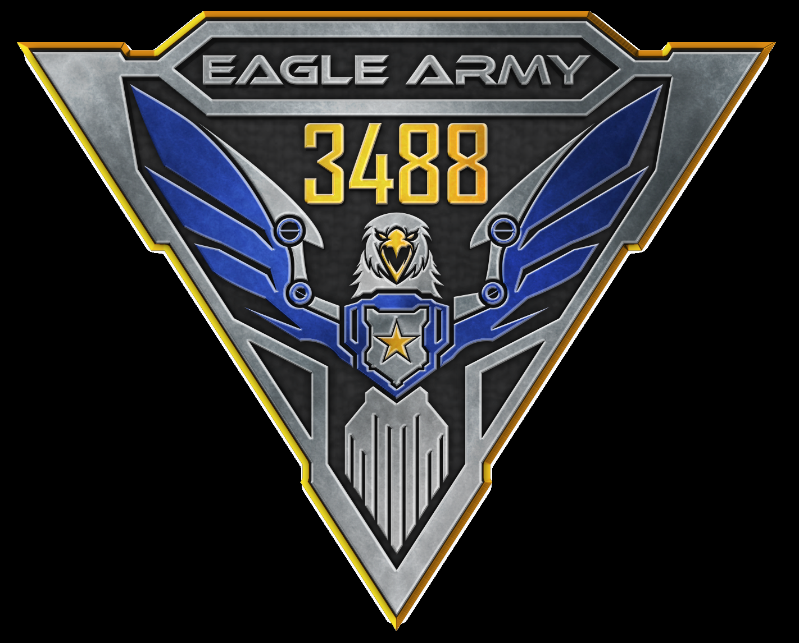

# Eagle Army Docs

## Welcome!
Weclome to the Eagle Army 3488 website for documentation! This site contains info on getting started with robot software development, background on more advanced topics and features, as well as other tidbits that we picked up while being a part of the team.



Notice any issues or wish to add more info that may benefit future members? Feel free to contribute by making a pull request or by contacting any one of us at [insert contacts here]!

## Where should I start?
Completely new to programming? Check out [Resources](resources/index.md) on where to go to learn how to code, and for other useful info too! Otherwise, if you already have a bit of experience, feel free to start at [Getting Started](getting-started/index.md) to get yourself set up.

---

# Administrative stuff

## @Documentation Team
* [Timeline](_admin/info/timeline.md) - Create a new project.  
* [Categories](_admin/info/categories.md) - Start the live-reloading docs server.
* [Writing Guidelines](_admin/info/guidelines.md) - Build the documentation site.
* Weekly notes will also be posted from each meeting, just keep an eye on the `_admin` folder.

## Project layout
```bash
    mkdocs.yml      # The configuration file.
    docs/
        _admin/     # Folder with all our organizational stuff
            fox-box/        # Random notes from James
            info/           # General important project info
            weekly-notes/   # Notes from weekly meetings
        _assets/    # Folder containing assets other than text
        autonomous/ # Category for autonomous docs
        code-examples/  # Category for sample code
        ...         # Omitted other sections
        resources/  # Category for resources
        index.md    # The documentation homepage.
```